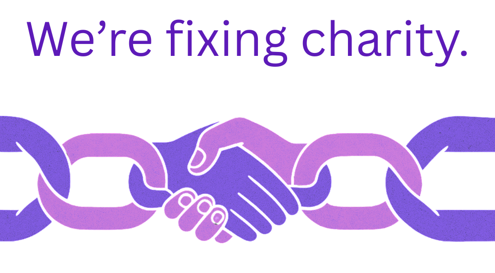
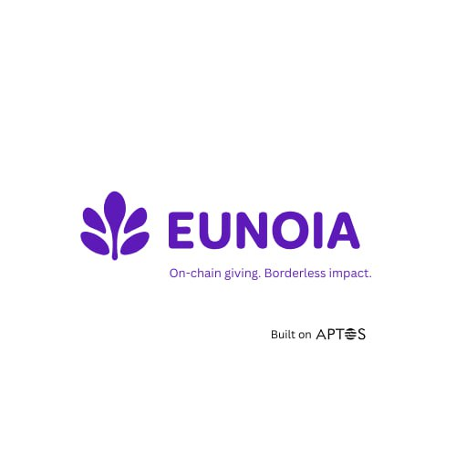
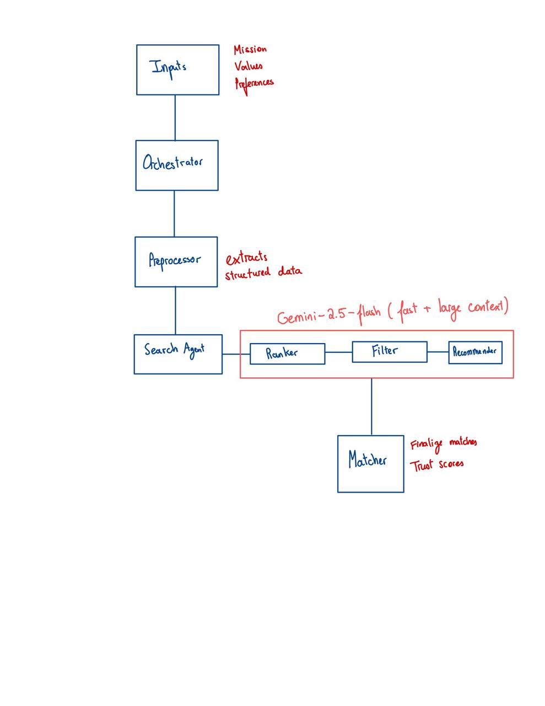

## 👥 The Team

<p align="center">
  
</p>

> **Randomly recruited on LinkedIn & Telegram. Perfectly balanced. Fully committed.**

| Name         | Role                               | Background                         |
|--------------|------------------------------------|-------------------------------------|
| **Randy**    | AI Engineer                        | McGill University                   |
| **Alex**     | Product Manager                    | University of Waterloo              |
| **Jimmy**    | Web3 Engineer & Quant              | McMaster University                 |
| **Alejandro**| AI, Full Stack & Cybersecurity     | University of Waterloo              |
| **Chelsea**  | Finance & Strategic Partnerships   | Columbia University                 |

- 💻 **Perfect mix:** Web3 × AI × Full-Stack × PM × Finance  
- 🌍 **8 languages spoken**  
- 🎯 **Startup + nonprofit experience**  
- 🤝 Bonded over Chick-Fil-A  
- 🧠 Built 12+ agents, smart contracts, and real-world impact tools


## 👥 EUNOIA - We're fixing Charity. 
<p align="center">
  
</p>

<p align="center">
  
</p>

<p align="center">
  <b>🧠 Full-Stack AI Agents</b><br>
  <b>💸 Charity without middlemen</b><br>
  <b>🔗 Multi-chain: Aptos + Polkadot</b><br>
  <b>🕵️ Track where your donation is going</b>
</p>

<!-- <p align="center">
  
</p> -->

**Charity is broken. We're fixing it.**

Eunoia is an agent-powered giving platform that brings **radical transparency** to philanthropy. Built initially on Aptos and now expanding to Polkadot, Eunoia tracks every penny from wallet → charity → real-world spend — all on-chain.

We eliminate middlemen, minimize fees, and restore trust in giving. With our optional **0.20% "Amplify Impact"** model, platform growth funds itself — not the charities.

---

## 💔 The Problem

> *"She robbed me of being a parent."* — Robyn, donor misled by a fraudulent agency

Stories like Robyn's and Kelly's are far too common: $10,000 sent to adopt a child, and the funds disappeared. Children went underfed, and $400,000 was misused.

- $7B+ lost every year to fraud, mismanagement, or opacity in the charity sector  
- Up to 5% fees taken by platforms like GoFundMe  
- 81% of donors **don't trust nonprofits**

---

## 🧠 How Eunoia Works

**Traditional giving is built on trust in logos.  
Eunoia builds trust with data.**

Instead of slow, manual vetting, our smart AI agents — we call them **Compass** — scan, rank, and recommend causes aligned with your values. You just describe what matters to you. We handle the rest.

> **🧭 Real-time agents. Transparent donations. No spreadsheets. Just impact.**

---

## ✨ Key Features

- **🔮 Radical Transparency:** All donations and fund distributions recorded on-chain
- **🧭 AI-Powered Matching:** Agents match you with causes that fit your vision
- **🔄 Direct Giving:** Donations go straight to charities or individuals
- **⛓️ Multi-Chain Support:** Supports Aptos and Polkadot, expanding further
- **💸 Ultra Low Fees:** Minimal platform fees; 0.20% optional for growth
- **⏱️ Real-Time Impact:** Donors track their money's impact immediately
- **👥 Advocate-Focused:** Enables small orgs, field workers, and missionaries
- **🔐 Secure + Verifiable:** Auditable smart contracts and verified charities
- **🎨 Intuitive UI/UX:** Easy for anyone to use — donors and charities alike

---

## 🛣️ What's Done and What's Next

- ✅ Launch on Mainnet and send to initiative in Middle East
- ✅ Customer interviews with philanthropists, CEOs, developers
- ✅ Multi-chain integration with PolkaDot's Testnet
- 🔜 Onboard first 5 verified charities  
- 🔜 Run $1,000+ in real donations, tracked end-to-end  
- 🔜 Expand to 10+ underfunded causes in East Africa & SE Asia  
- 🔜 Launch full-stack AI agent platform  
- 🤝 Partner with EasyA & Foundation Collective for on-ground campaigns

---

## 🌍 Backed by Builders

We've been supported by communities like **EasyA**, **Aptos Foundation**, **Polkadot Foundation**, and founders across the Web3 space.

---

## 🛠️ Technology Stack

### 💻 Frontend (`eunoia_web`)
*   **Framework/Library:** React (with Hooks and Context API)
*   **Routing:** React Router
*   **UI Components:** Material UI (MUI)
*   **API Communication:** Axios
*   **State Management:** React Context API (supplemented by component state)
*   **Blockchain Interaction:**
    *   Aptos: Aptos Wallet Adapter, Aptos SDK (`aptos`)
    *   Polkadot: Polkadot.js (`@polkadot/api`, `@polkadot/extension-dapp`)

### ⚙️ Backend (`eunoia_backend`)
*   **Framework:** Django (Python)
*   **API:** Django REST Framework
*   **Database:** SQLite (development), PostgreSQL (production-ready)
*   **Image Handling:** Pillow
*   **CORS:** `django-cors-headers`
*   **AI/ML (for Semantic Search & Agent System):**
    *   Libraries like `sentence-transformers`, `scikit-learn`, `nltk` (details in specific agent implementations)
    *   Vector Database (e.g., FAISS, Pinecone - depending on deployment) for embeddings.

### 🔗 Blockchain
*   **Aptos Network:**
    *   **Language:** Move
    *   **Smart Contract:** `eunoia.move` (in `contract/sources`)
*   **Polkadot Network (via parachains/smart contract platforms):**
    *   **Language:** ink! (Rust-based eDSL)
    *   **Smart Contract:** `eunoia2` (in `polkadot_contracts/eunoia/lib.rs`)

---

## 🏗️ System Architecture Overview

**Frontend (React)**
- Browsing, wallet connection, donations  
- Talks to backend + blockchain directly

**Backend (Django)**
- Charity verification, API layer  
- Admin + content management

**Smart Contracts**
*   **Aptos (`eunoia.move`):** Contains the core logic for receiving donations and managing charity registrations on the Aptos network.
*   **Polkadot (`eunoia2/lib.rs`):** Provides similar donation and charity management functionalities on Polkadot-compatible chains using ink!.
*   Both contracts are designed for transparency, emitting events for key actions like donations and registrations.

**High-Level Compass Agent Architecture**



**Semantic Search Architecture**


---

## 🔍 Smart Contracts Overview

Eunoia's frontend is designed to interact with multiple blockchains. Here's how:

### Aptos Network
*   **Wallet Connection:** The frontend likely uses a library compatible with the Aptos Wallet Adapter standard (e.g., `@manahippo/aptos-wallet-adapter`, `@pontem/wallet-adapter-plugin-petra` or directly interacting with `window.aptos` if Petra is the primary target) to allow users to connect their Aptos wallets.
*   **Reading Blockchain Data:** The `AptosClient` from the `aptos` official SDK is used to query blockchain state, such as account balances (e.g., `0x1::coin::balance`) or view function results from the `eunoia.move` smart contract.
*   **Executing Transactions:** Once a wallet is connected, transaction signing and submission (e.g., for donations) are handled through the wallet adapter, which typically calls the `signAndSubmitTransaction` method provided by the connected wallet. The payload for this function is constructed according to the `eunoia.move` smart contract's entry function interface (e.g., for the `donate` function).

### Polkadot Network
*   **Wallet Connection:** The `@polkadot/extension-dapp` library is used to discover and connect to Polkadot ecosystem browser extensions (e.g., SubWallet, Polkadot.js extension). It allows users to select an account and authorize the dApp.
*   **Reading Blockchain Data & Contract Interaction:** The `@polkadot/api` (specifically `ApiPromise`) is used to connect to a Polkadot node (or parachain node). Once connected, it's used to:
    *   Query chain state (e.g., `api.query.system.account` for balances).
    *   Instantiate a contract object using the deployed ink! contract's address and metadata (ABI from the `.contract` file).
    *   Call contract messages: read-only messages (view functions) are queried directly, while transactions (state-changing messages) are constructed for signing.
*   **Executing Transactions:** For state-changing operations like donations, transactions are constructed using the `@polkadot/api` contract instance. These transactions are then signed and sent using the injector provided by `@polkadot/extension-dapp` for the user's selected account.

### General Approach in `DonatePage.js` (example)
*   The `AppContext` likely manages the `activeChain`, `walletAddress`, and connections to `AptosClient` or `ApiPromise`.
*   Functions like `handleConnectWallet`, `getAptosBalance`, `getPolkadotBalance`, `handleAptosDonation`, and `handlePolkadotDonation` encapsulate chain-specific logic.
*   Constants for node URLs (e.g., `APTOS_NODE_URL`, `POLKADOT_NODE_URL`) and contract addresses/module names are defined (e.g., `MODULE_ADDRESS`, `POLKADOT_CONTRACT_ADDRESS`).
*   Token types and their respective on-chain identifiers (e.g., `TOKEN_TYPES` mapping `APT` to `0x1::aptos_coin::AptosCoin`) are used for multi-currency support within donations.

---

## 📘 Smart Contract Details

The Eunoia platform utilizes smart contracts on both the Aptos and Polkadot networks to handle core donation logic, charity registration, and fund distribution transparently and securely.

### 🔐 Aptos Smart Contract Details (`eunoia.move`)

Located in `contract/sources/eunoia.move` (module `eunoia_foundation`), our Move contract implements the following key functionalities:

#### Core Resources and Data Structures
*   **`ContractData`**: A central resource stored under the module publisher's account. It holds:
    *   `donation_history_table`: A `Table<address, vector<HistoryEntry>>` mapping donor addresses to their donation records.
    *   `charity_wallets_table`: A `Table<string::String, address>` mapping charity names to their Aptos wallet addresses.
    *   `charity_raised_amounts_table`: A `Table<string::String, table::Table<type_name::TypeName, u64>>` mapping charity names to another table, which maps coin types to the total amount raised for that coin.
*   **`HistoryEntry`**: A struct representing a single donation, containing:
    *   `charity_name`: The name of the recipient charity.
    *   `coin_type_name`: The type of coin donated.
    *   `amount`: The amount donated.
    *   `timestamp_micros`: Timestamp of the donation.

#### Key Functions
*   **`initialize_module(sender: &signer)`**: Initializes the `ContractData` resource with empty tables. Called once by the module owner.
*   **`add_charity(sender: &signer, charity_name: string::String, charity_wallet: address)`**: Allows the module owner to register a new charity by adding its name and wallet address to the respective tables. Emits a `CharityRegisteredEvent`.
*   **`donate<CoinType>(donor: &signer, charity_name: string::String, amount: u64)`**: The primary function for making donations.
    *   Transfers `amount` of `CoinType` from the `donor` to the registered `charity_wallet`.
    *   Records the donation in the `donation_history_table`.
    *   Updates the `charity_raised_amounts_table`.
    *   Emits a `DonateEvent`.
*   **`get_donation_history(donor_address: address): vector<HistoryEntry>` (view function)**: Retrieves the donation history for a given donor address.
*   **`get_charity_raised_amount(charity_name: string::String, coin_type: type_name::TypeName): u64` (view function)**: Returns the total amount of a specific `coin_type` raised by a charity.
*   **`get_charity_wallet(charity_name: string::String): address` (view function)**: Returns the registered wallet address for a given charity.

#### Events
*   **`DonateEvent`**: Emitted upon a successful donation. Contains `donor_address`, `charity_name`, `coin_type_name`, `amount`, and `timestamp_micros`.
*   **`CharityRegisteredEvent`**: Emitted when a new charity is registered. Contains `charity_name` and `charity_wallet`.

#### Security and Design
*   Utilizes Aptos's resource-oriented programming model for safe state management.
*   Access control: Administrative functions like `add_charity` are restricted to the module owner.
*   Uses generic `CoinType` for donations, making it flexible for various Aptos standard coins.
*   Comprehensive error handling using `assert!` for conditions like unregistered charities. Balance checks are implicitly handled by the Aptos framework during coin transfers.

### 🌐 Contract Deployment (Aptos)

The smart contract is configured in `contract/Move.toml`.
**Testnet Deployment Address:** `0x3940277b22c1fe2c8631bdce9dbcf020c3b8240a5417fa13ac21d37860f88011` (Module name: `eunoia_foundation`)

### 🦀 Polkadot (ink!) Smart Contract Details (`eunoia2` module - `lib.rs`)

Located in `polkadot_contracts/eunoia/lib.rs`, our ink! smart contract provides donation and charity management functionalities for the Polkadot ecosystem.

#### Core Storage Items
*   **`owner: AccountId`**: Stores the `AccountId` of the contract administrator.
*   **`donation_histories: Mapping<AccountId, Vec<HistoryEntry>>`**: Maps a donor's `AccountId` to a vector of their `HistoryEntry` structs.
*   **`charity_wallets: Mapping<String, AccountId>`**: Maps a charity's name (as `String`) to their wallet `AccountId`.
*   **`charity_raised_amounts: Mapping<(String, String), Balance>`**: Maps a tuple of (charity name, coin name/ticker) to the total `Balance` (u128) raised. (Note: This primarily tracks the native token unless extended for PSP22 tokens).

#### Key Structs and Events
*   **`HistoryEntry` (struct)**: Records `donor: AccountId`, `charity_name: String`, `coin_name: String`, `amount: Balance`, `timestamp: Timestamp`.
*   **`DonateEvent` (event)**: Emitted on donation. Includes donor, charity name, coin name, amount, and timestamp.
*   **`CharityRegisteredEvent` (event)**: Emitted on charity registration. Includes charity name and wallet address.
*   **`Error` (enum)**: Defines errors like `NotOwner`, `CharityNotFound`, `TransferFailed`.

#### Key Functions (Messages)
*   **`new() -> Self` (constructor)**: Initializes `owner` to the caller and empty mappings.
*   **`add_charity(&mut self, charity_name: String, charity_wallet: AccountId)`**: Owner-only. Registers a charity. Emits `CharityRegisteredEvent`.
*   **`donate(&mut self, charity_name: String, coin_name: String)` (payable message)**: Allows users to donate native tokens.
    *   Checks if charity exists.
    *   Transfers `self.env().transferred_value()` to the charity.
    *   Records history, updates amounts, emits `DonateEvent`.
*   **`get_donation_history(&self, donor: AccountId) -> Vec<HistoryEntry>` (view)**: Retrieves donor's history.
*   **`get_charity_raised_amount(&self, charity_name: String, coin_name: String) -> Balance` (view)**: Gets amount raised by a charity for a coin.
*   **`get_charity_wallet(&self, charity_name: String) -> Option<AccountId>` (view)**: Gets a charity's wallet.

#### Security and Design Considerations
*   Owner-restricted administrative functions.
*   Payable messages for receiving funds.
*   Error handling via `Result` type.
*   Events for off-chain tracking.
*   Uses `Mapping` for efficient storage.

### 🌐 Contract Deployment (Polkadot)
1.  Compile to Wasm and metadata: `cargo contract build` in `polkadot_contracts/eunoia`.
2.  Deploy the `.contract` bundle (from `target/ink/`) to a Substrate chain with `pallet-contracts` using tools like Polkadot-JS Apps.

---

## 🔄 User Flow (Interaction Flow)

1.  **Discovery & Connection (Frontend):**
    *   User visits Eunoia, browses charities (data via Django API).
    *   User connects their Aptos or Polkadot wallet.
2.  **Donation (Frontend → Smart Contract):**
    *   User selects charity, amount, and network.
    *   Frontend constructs the appropriate transaction for the selected chain's smart contract (`eunoia.move` on Aptos, `eunoia2` on Polkadot).
    *   User confirms the transaction in their wallet.
3.  **Execution & Recording (Blockchain):**
    *   Transaction is processed on-chain.
    *   Smart contract transfers funds, records donation, emits `DonateEvent`.
4.  **Feedback (Frontend/Backend):**
    *   Frontend updates UI upon transaction confirmation.
    *   (Future) Backend may listen to events to update its database for aggregated views or dashboards.

---

```bash
git clone <repo-url>
cd backend/eunoia_backend

# Create & activate virtual environment
python -m venv venv
source venv/bin/activate  # On Windows use: venv\Scripts\activate

# Install dependencies
pip install -r requirements.txt

# Apply DB migrations
python manage.py migrate

# Create superuser (for Django Admin)
python manage.py createsuperuser

# Optional: Load test data
python create_charity.py

# Run backend server
python manage.py runserver  # Runs on http://127.0.0.1:8000
```

### 🧑‍🎨 Frontend Setup

```bash
cd ../../eunoia_web
npm install
npm start  # Runs on http://localhost:3000
```

### 🔗 Smart Contract Setup

#### 🟣 Aptos (Move)

```bash
cd contract
aptos move compile
aptos move test

# Deploy (requires funded account)
aptos move publish --named-addresses eunoia=<your_account_address>
```

#### 🐞 Polkadot (ink!)

```bash
cd polkadot_contracts/eunoia
cargo contract build  # Produces .contract Wasm bundle
```

---

## 🔑 Admin + Key Functions

-   **Charity Onboarding:** `/register-charity` (frontend form) submitting to backend API; verification via Django Admin (`/admin/`).
-   **Donations:** Initiated from frontend, executed by smart contracts on Aptos or Polkadot.
-   **Blockchain Logging:** `DonateEvent` and `CharityRegisteredEvent` provide on-chain audit trails.
-   **Platform Administration:** Django Admin for managing verified charities, platform settings, and potentially viewing aggregated (off-chain mirrored) transaction data.

---

## 📚 Appendix: Technical Extras

### 🧠 Agent System – Compass

Our AI agent system, "Compass," is designed for modularity and extensibility. The vision will include multiple specialized agents:

*   🔍 **Search Agents:** Query diverse data sources (on-chain registries, charity databases, web content) to identify potential causes.
*   🧾 **Vetting Agents:** Analyze charity credentials, financial transparency reports (if available), and public sentiment to assess credibility. This can involve NLP on documents and web data.
*   💡 **Matching Agents:** Use semantic understanding (embeddings, NLP) of a donor's stated "vision" or interests to compare against processed charity information, providing a relevance score.
*   📊 **Impact Tracking Agents (Future):** Monitor charity-reported outcomes or on-chain fund utilization (where possible) to provide donors with updates on their contribution's impact.
*   💬 **Feedback & UI Agents:** Collect user feedback on matches and interact with the frontend to present information clearly.

These agents are envisioned to work within an orchestrated pipeline, potentially using a task queue system for asynchronous processing. Prompt engineering and versioning of AI model interactions are key considerations. This is a **work in progress.**

### 🔐 Contract Security Features

Security is paramount. Our smart contracts incorporate several features:

**Aptos (`eunoia.move`):**
*   **Ownership/Admin Control:** Critical functions like `add_charity` are protected and can only be called by the module owner (deployer account).
*   **Type Safety:** Move's strong type system and resource model prevent many common vulnerabilities.
*   **Event Emission:** All significant state changes (donations, registrations) emit events for external verification and auditing.
*   **Input Validation:** Checks ensure valid inputs (e.g., charity must exist before donation). Aptos framework handles balance checks.
*   **No Reentrancy (by design in Move):** Move's execution model generally prevents reentrancy attacks common in other environments.

**Polkadot (ink! - `eunoia2/lib.rs`):**
*   **Ownership:** Administrative messages (e.g., `add_charity`) are restricted to the `owner` set during contract instantiation.
*   **Error Handling:** Messages return `Result` types, allowing clear error propagation (e.g., `NotOwner`, `CharityNotFound`).
*   **Explicit Payability:** Only messages intended to receive funds (like `donate`) are marked `payable`.
*   **Event Emission:** Key actions trigger events for off-chain observability.
*   **Checks-Effects-Interactions Pattern (Recommended):** Adhering to this pattern is crucial: first perform checks, then update internal state (effects), then interact with other contracts/accounts.
*   **Gas Management:** ink! contracts operate within Substrate's gas metering, preventing runaway execution.

Regular audits and adherence to best practices for both Move and ink! development are part of the ongoing security strategy.

---

## 🤝 Want to Contribute?

```bash
git clone <repo-url>
git checkout -b feature/your-feature-name
# Make changes
git commit -am "Your description"
git push origin feature/your-feature-name
# Then open a Pull Request
```

---

## 🔗 Connect With Us

- 🌍 [Website](https://www.eunoia.work)
- 📱 [Telegram](https://t.me/+aDt6-_BdrTtjODMx)
- 💻 [GitHub](https://github.com/JY20/eunoia)
- 🎮 [Discord](https://discord.com/invite/CWYXFqyQe6)
- 𝕏 [Twitter/X](https://x.com/eunoia_give)

---

> *Let's fix giving. With agents, not middlemen.*
